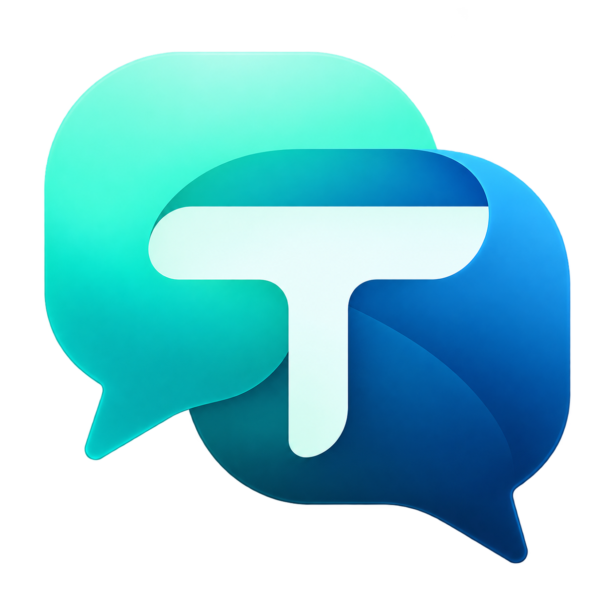
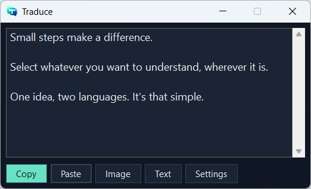
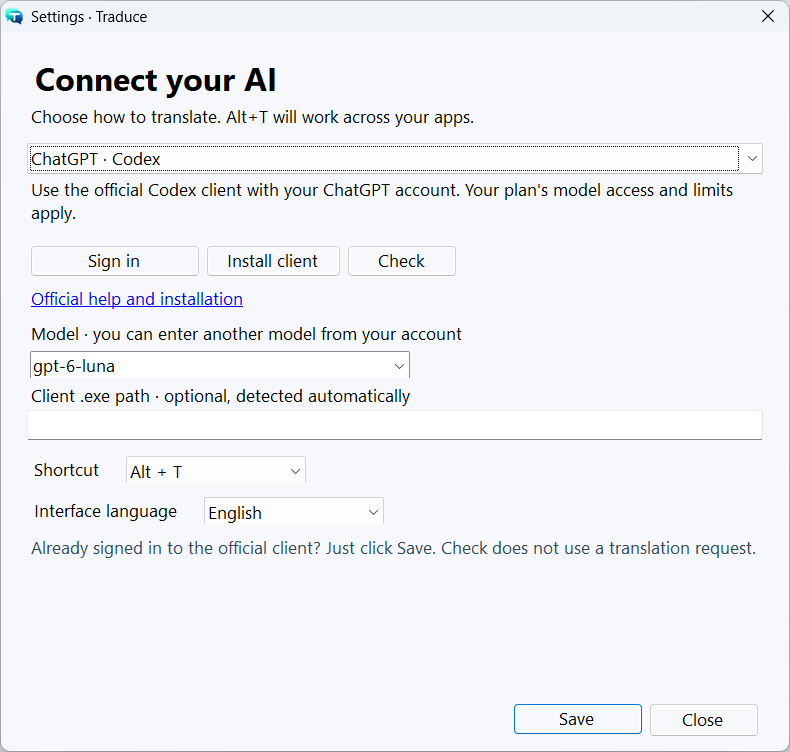

<p align="center"></p>

# Traduce

**[English](README.md) · [Español](README.es.md)**

**Select a screen region with Alt+T and translate it with your AI.** A small Windows app with local OCR and support for text and images.

[Download installer](https://github.com/Yev94/traduce/releases/latest/download/Traduce-Setup.exe) · [Portable ZIP](https://github.com/Yev94/traduce/releases/latest/download/Traduce-Windows-x64.zip) · [All releases](https://github.com/Yev94/traduce/releases)

Translate other languages into **Spanish**, and Spanish into **English**. Works with browsers, documents, images and any app Windows can capture.



## Interface language

Open **Settings → Interface language**, choose **Español** or **English**, and click **Save**. Buttons, menus, messages and errors switch without restarting. Your choice is remembered. New installations follow the Windows language (English unless it is Spanish); existing installations keep Spanish.

The interface language does not change the translation direction: Spanish → English; other languages → Spanish.

<details>
<summary>Show connection settings and the language selector</summary>



</details>

## Get started

1. Download and run **Traduce-Setup.exe**. It installs for your Windows user without administrator access. You can leave startup with Windows enabled.
2. Choose a connection on first launch:
   - **ChatGPT · Codex** or **Claude Code**: click **Install client** if needed, then **Sign in**. Complete the provider's official browser sign-in. Already signed in? Click **Check** and **Save**.
   - **API**: enter your key, optionally **Load models** to check the connection or choose another model, then **Save**. Each provider keeps its own settings.
   - **Ollama**: start Ollama, download a model and select it with **Load models**.
3. Press **Alt+T**, drag over the content and release. Windows recognizes text locally; when it finds no text, Traduce sends the crop as an image.

**Requirements:** Windows 10/11 x64 and .NET Framework 4.8. No SDK, Python or Node is needed to run Traduce. Account connections require the official client. WinGet (App Installer) allows installation from the app; an official installation link is also provided.

The ZIP requires no installation: extract `Traduce.exe` and `Traduce.exe.config` together, then run the EXE. It does not add automatic startup. Settings are still saved per user in AppData. On another computer, sign in again or enter your API key there; do not copy credentials between computers.

These executables are not publisher-signed yet; Windows may display a warning after download. Each release includes `SHA256SUMS.txt`.

## Providers

| Connection | Access | Initial model |
| --- | --- | --- |
| ChatGPT · Codex | Your session in the official Codex client | `gpt-6-luna`, low reasoning |
| Claude Code | Your session in the official Claude Code client | `haiku` |
| OpenAI API | OpenAI Platform key | `gpt-6-luna`, no additional reasoning |
| Claude API | Claude Console key | `claude-haiku-4-5` |
| Google Gemini API | AI Studio key | `gemini-3.8-flash` |
| OpenRouter API | OpenRouter key | Choose a model from your account |
| Local Ollama | Local server at `localhost:11434` | A model you have downloaded |
| Other OpenAI-compatible API | Base URL, key and model | Configurable |

You can enter another model identifier. Availability depends on your account. Image translation requires a vision model; text models can translate text extracted by OCR.

Subscriptions are used **through the official client installed and authenticated by each user**, subject to its limits and terms. Traduce does not implement its own subscription login or extract client tokens. Not all AI subscriptions support this usage. APIs have quotas and billing separate from web subscriptions.

The generic option uses `POST /chat/completions` and `GET /models`. It supports compatible providers; proprietary APIs require an adapter. Base URLs must use HTTPS; HTTP is allowed only on the local computer. Changing the URL discards the previous key so it cannot be sent to the new server. If the server does not expose `/models`, enter the model manually.

## Everyday use

- **Esc** or right-click cancels selection. Another Alt+T replaces the pending request; an older response cannot overwrite the new result.
- **Copy** copies the translation. **Paste** accepts clipboard text or images. **Image** opens an image directly, bypassing OCR. **Text** lets you review or edit the original.
- The window matches the crop width, limited by the monitor's work area. It appears above or below the selection, stays on top and leaves focus in the source app. Multiple monitors and display scales are supported.
- Closing the window keeps it in the tray with the shortcut active. Choose **Quit** from the tray menu to exit.
- **Settings** lets you change the provider, model, key, shortcut and interface language. Up to 12 results are cached in memory and discarded on exit.

Capturing does not modify the clipboard or replace the source application's content. OCR depends on the languages installed in Windows and may omit text or lose formatting. To bypass incomplete recognition, paste a screenshot or use Image. Content Windows captures as black cannot be read.

## Privacy and logs

The full screen capture stays in memory while you select. Only the crop is processed. **Recognized text or the cropped image** is sent to the selected provider when you request translation. With local Ollama, requests go to the local server.

API keys are encrypted with **Windows DPAPI for the current user**. Traduce does not display or copy official client tokens. It keeps no text or translation history. Temporary images used by Codex are deleted on completion or cancellation; a forced shutdown may leave `Traduce-*` files in TEMP. Provider/client logs and retention follow their own policies.

Local logs are at `%LOCALAPPDATA%\Traduce\logs\captures-YYYY-MM-DD.jsonl`. They record the active app and app under the crop (executable, PID, window class), `text`/`image` mode, OCR reason, character count, provider/model, timings, geometry/monitor and outcome. **They contain no window titles, text, images, keys or translations.** They are not uploaded.

To analyze detection, count only `capture` events and group by `active_app.process`, `mode` and `ocr_reason`; `finished` events provide outcome and duration. The text detection rate does not measure OCR accuracy. Paste, Image and manual text translation are excluded from crop logs.

## Update and uninstall

Run the new installer to update. It preserves settings and logs and closes the previous instance. Uninstall through **Windows Settings → Apps → Traduce**. User data is retained; after exiting, you can delete `%LOCALAPPDATA%\Traduce` to remove it. Official AI clients are not uninstalled.

Automatic startup uses the `Traduce.lnk` shortcut in `shell:startup` with `--background`. Disable it in Windows Startup apps or remove that shortcut. `Traduce.exe --quit` closes the app for updates.

## Build

C# 5 / WinForms, .NET Framework 4.8 and the Windows 10/11 SDK (`Windows.winmd`). No NuGet dependencies. From PowerShell in the repository:

```powershell
.\build.ps1 -ContractTest   # Build and test API/CLI contracts without credentials
.\build.ps1 -Test           # Include UI, OCR, clipboard and actual startup tests
.\package.ps1 -SkipBuild    # Installer + ZIP + hashes; requires Inno Setup 6
```

Install Inno Setup with `winget install --id JRSoftware.InnoSetup --exact --scope user`. To build, package and install locally: `./install.ps1 -Launch`.

Full tests require a Windows desktop. To check the global shortcut and placement on connected monitors, close Traduce and run `./build.ps1 -DesktopTest` on an unlocked desktop; do not switch windows during the test. `./build.ps1 -LiveTest` sends **three real Codex requests** using your session: text, OCR text and an image. Ordinary tests do not contact paid services.

GitHub Actions builds, runs contract tests and packages the app. It does not run desktop/OCR tests or paid services on the runner. User downloads are published in Releases; CI artifacts are available for each build.

## Contribute and visual assets

Open source under the [MIT license](LICENSE). Report problems or suggest changes on [GitHub](https://github.com/Yev94/traduce/issues). Keep both READMEs in sync and add UI translations to `assets/en.json`; changing the interface language must never translate captured content.

The [PNG logo](assets/logo.png) has real transparency. The [Windows icon](assets/traduce.ico) includes sizes from 16 to 256 px. [Logo origin and prompt](docs/branding.md).

Regenerate the icon with `./scripts/make-icon.ps1`. To capture the actual app windows for documentation, compile with `-Test`, close the installed app and run `./dist/Traduce.Tests.exe --screenshots`. It uses only the included sample content and does not contact AI services.

## Official documentation

[Codex authentication](https://developers.openai.com/codex/auth) · [Non-interactive Codex](https://developers.openai.com/codex/noninteractive) · [GPT-6 Luna API](https://developers.openai.com/api/docs/models/gpt-6-luna) · [Claude Code CLI](https://code.claude.com/docs/en/cli-reference) · [Claude Code integration terms](https://code.claude.com/docs/en/legal-and-compliance) · [Claude Messages](https://platform.claude.com/docs/en/api/messages/create) · [OpenAI-compatible Gemini](https://ai.google.dev/gemini-api/docs/openai) · [OpenRouter](https://openrouter.ai/docs/quickstart) · [Ollama](https://docs.ollama.com/api/openai-compatibility)

Independent project, not affiliated with these providers. MIT licensed.
